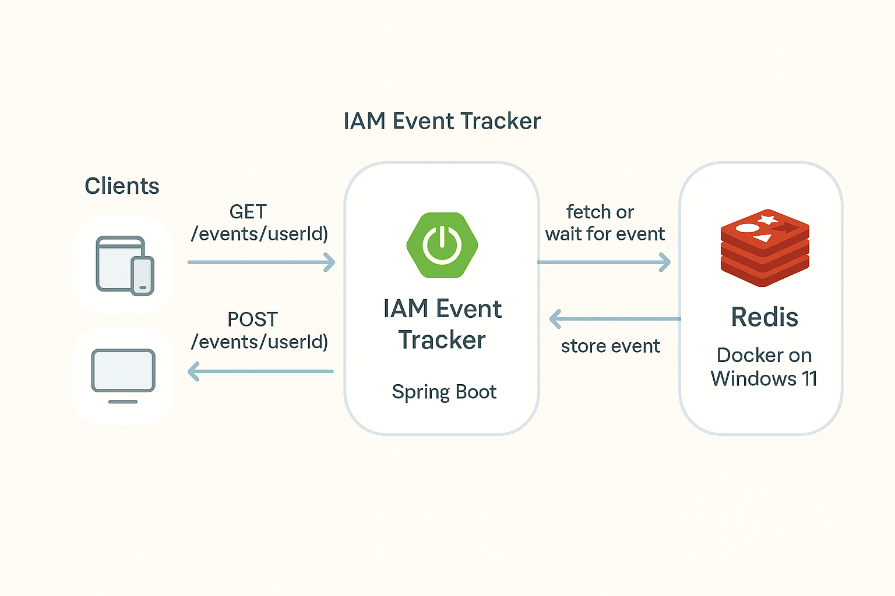

📦 IAM Event Tracker – Long Polling Microservice
A lightweight microservice designed to push real-time IAM events to clients using HTTP long polling and Redis. Built with Java, Spring Boot, and Docker.

⚙️ Features
✅ Long Polling endpoint for real-time IAM event delivery

✅ Redis used for user-specific event queues

✅ POST endpoint for pushing new events

✅ Docker-compatible Redis setup

✅ Easily integratable into any IAM or Notification pipeline

📐 Architecture Overview

🔄 How It Works
Client sends a GET /events/{userId} request (long-polling).

Server checks Redis:

If data exists: return immediately.

Else: wait until new data or timeout.

When someone pushes data via POST /events/{userId}:

Event is saved in Redis.

If any client is waiting → it is instantly notified.

🔌 API Overview
POST /events/{userId}
Pushes a new event for a specific user.

Request Body:

json
Copy
Edit
{
  "event": "You were added to Admin group"
}
GET /events/{userId}
Client polls for new events.

Returns:

If event available: immediately returns

Else: waits (up to 30s) then times out with empty response

🔧 Tech Stack
Tool	Usage
Java	Backend logic
Spring Boot	REST API & async handling
Redis	In-memory queue per user
Docker	Redis container on Windows 11
📦 Redis Data Format
Key: events:{userId}

Value: List of event strings (or JSON)

🖼 Future Integration Diagram

🔮 Future Enhancements
Event Types (IAMEvent object with type, time, etc.)

JWT Auth for secure client tracking

TTL for Redis queues to avoid memory bloat

Basic front-end client for auto-reconnect demo

Integration with Kafka or RabbitMQ for scaling

🚀 Getting Started
Start Redis:

bash
Copy
Edit
docker run -d --name redis -p 6379:6379 redis
Run the Spring Boot app

Test it with:

`curl -X POST http://localhost:8080/events/123 \
     -H "Content-Type: application/json" \
     -d '{"event": "You logged in"}'
`
